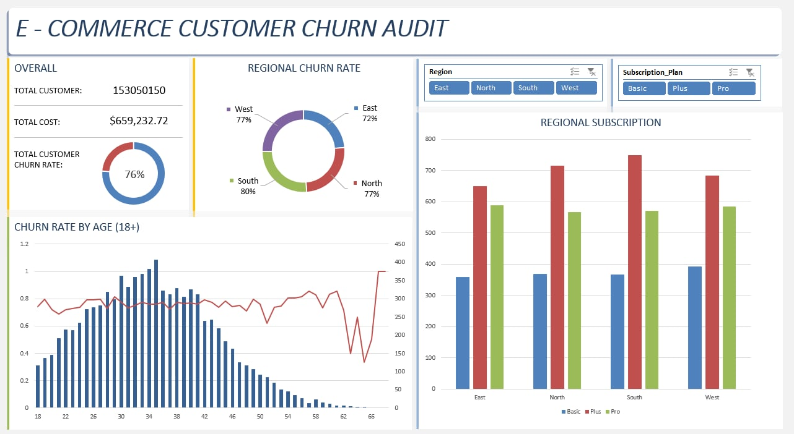

# EXCEL DASHBOARD

## DASHBOARD IMAGE

## _PIVOT TABLES_
### _OVERALL_
>---
> **_DATA_**
>
>       - TOTAL CUSTOMER
>       - MONTHLY SPEND
>       - AVERAGE CHURN (DOUGHNUT CHART)
>---

### _REGIONAL CHURN RATE_
>---
>**_CHART_**
>
>      - DOUGHNUT CHART
>
>**_DATA_**
>
>       - REGION
>       - CHURN (AVERAGE)
>---

### _CHURN RATE BY AGE_
>---
>
>       - AGE 18+ (WIDELY ACCEPTED LEGAL AGE)
>**_CHART_**
>
>       - COMBO CHART
>**_DATA_**
>
>       - AGE (BAR GRAPH)
>       - CHURN AVE (LINE GRAPH)
>---

### _REGIONAL SUBSCRIPTION_
>---
>
>**_CHART_**
>
>       - BAR CHART
>**_DATA_**
>
>       - REGION
>       - SUBSCRIPTION PLAN
>---

### SLICER
>---
>
>**_GRAPHS_**
>
>       - REGIONAL CHURN RATE
>       - CHURN RATE BY AGE (18+)
>       - REGIONAL SUBSCRIPTION
>---
 
 
 
 

